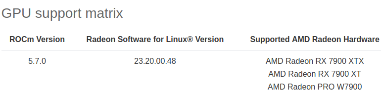

# The usability of AMD GPU (7900xtx)
This is just my personal experience and opinions. 
I bought RX 7900xtx in November 2023 for Pytorch, Stable diffusion and stuff for 40k THB (~ 1142 USD)

At the present(Dec 2023), It works well for normal usage of Pytorch, Stable diffusion with ROCM 5.7

I installed Rocm via instruction in https://rocm.docs.amd.com/projects/radeon/en/latest/docs/install/install-radeon.html

You can check pytorch wheel for pytorch stable and pytorch nightly by these links: https://download.pytorch.org/whl/torch/, and https://download.pytorch.org/whl/nightly/torch/

## Benefit of AMD GPU that led the me buying it
* It is far cheaper than the Nvidia counterpart.
* Rocm is open-source.

## Limitation and drawback
* Bitsandbytes cannot be used for ROCM 5.7 (Third-party repositories only made it support 5.6)
* Llama CPP only supports ROCM 5.6.1 as the latest version of ROCM. When I try to use it. The utilization of shader clock stuck at 100%
* Rocm is not as widely adopted as CUDA yet.

* AMD only officially supported flagship GPU at the time for Consumer grade GPU.
* Rocm+Pytorch combo is only usable on Linux at the time of writing
* Classical ML libraries like xgboost, catboost, and other automl libraries(autogluon, pycarret) don't support rocm.

# Training speed
you can see example in ./running result 7900xtx 
compared to A100 training https://colab.research.google.com/drive/1uB6CWbsQcPQabl7CzMznYZ59lktSAPcZ?usp=sharing, and https://colab.research.google.com/drive/1yCDFx860A1gwyXSlMjMIWVMLuXs66d6K?usp=sharing

bf16 training on 7900xtx is faster than A100 but lora is slower (I guess it is due to the fact that Rocm 5.7 is not officially supported by Bitsandbytes => poorly optimized.)